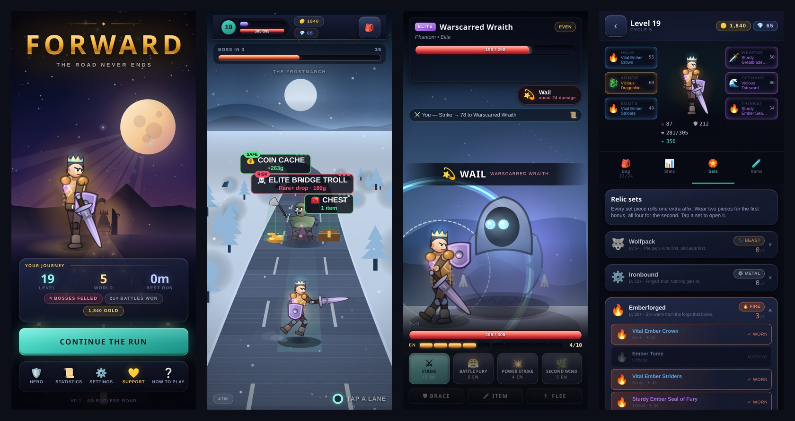

# Forward

**An endless-road RPG runner for phones.** Your hero runs forward on their own; every few
seconds three lanes open up ahead — a monster, a chest, a campfire, a shrine, a trader, or
something unknown — and you pick one. Fights play out on their own screen as tactical
turn-based duels with a timed parry. You loot and equip gear, level up, and when the road meter
fills, a boss blocks the way with no lane around it. Beat it and the road moves on to a new
biome. The road never ends.



- Tactical turn-based combat: telegraphed enemy moves, weapon skills, brace, potions, and a
  **perfect-timing parry** (tap the hero as the blow lands).
- 150 item bases × 6 rarities with random affixes; 6 relic sets with 2- and 4-piece bonuses
  and their own fire / water / void / light combat effects; talents on level-up.
- 34 enemies, 20 scripted bosses with phases and passives, 12 biomes.
- Everything is procedural: characters are vector rigs drawn on Canvas 2D, music and sound
  effects are synthesised with WebAudio — **no image or audio assets ship with the game**.
- Fully offline, no account, English and French.

## How this project came to be

This repository is an experiment with **Claude Fable 5.1**. I had an old, almost-forgotten
game idea — a short note in Russian ([`idea.md`](idea.md)) and a rough sketch
([`image.png`](image.png)): a character at the bottom of the screen moving forward, three lanes
to choose from, a level, a progress bar that ends in a boss fight, items to dress the character,
an endless game.

I wanted to see how far the model could take it from a **single prompt**: that note, the sketch
and a couple of clarifications, with every technical and design decision left to the model.
The first playable version came out of that one prompt. After that, a handful of follow-up
prompts upgraded it: make it a mobile app with room for monetisation, raise the visual and
gameplay quality, fix the bugs I hit. Then I played it for a while and wrote down everything
that felt wrong or missing in [`feedback.md`](feedback.md) — and that became the spec for the
next round (parry timing, contact attacks, fight log, sets, gems as a currency, new biomes, a
main screen, dynamic music, localisation, balance).

I liked the result enough to keep playing it, and I'm planning to release it on Google Play.

## Run it

```bash
npm install
npm run dev -- --host   # open the local URL in a phone-sized browser view,
                        # or the network URL on your phone over Wi-Fi
```

Other commands:

```bash
npm run build           # production web bundle -> dist/
npx tsc --noEmit        # type check
npm run sim             # headless combat-balance simulator (see scripts/BALANCE.md)
npm run i18n:check      # English/French completeness
npm run android:debug   # debug APK (needs JDK 17 + Android SDK 35, see docs)
```

## Tech

Vite + TypeScript, plain DOM/CSS for the interface, Canvas 2D for the world and fights,
WebAudio for sound, Capacitor for the Android app. No UI framework, no server.

## More

- [`docs/PROJECT-STATUS.md`](docs/PROJECT-STATUS.md) — architecture, what's done, known gaps, backlog, release checklist.
- [`docs/ADS-PLAN.md`](docs/ADS-PLAN.md) — plan for rewarded ads in the Android release.
- [`scripts/BALANCE.md`](scripts/BALANCE.md) — every balance knob and the simulator results.
- [`store/`](store/) — Google Play listing texts (EN/FR), privacy policy, store graphics.

© NGdev. All rights reserved.
